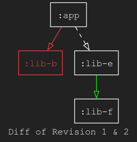

[](https://pypi.org/project/diff-dot/)
[](https://pypi.org/project/diff-dot/)

This library compares two directional graphs and outputs the diff result as a dot file.
Primary intended use is to compare changes in software dependencies, for example in gradle projects though it is designed to not be limited to gradle.

Github action
===

This repo contains an action that can be used to generate diagrams of local project dependency changes on pull requests, please see example_workflow/test_action.yml

"Deps" Input Format
===

The input for one graph is just multiple lines in the format:
```
a -> b
```
This line denotes that `a` depends on `b`.

You can also chain nodes:

```
a -> b -> c
```
This line denotes that `a` depends on `b`, and that `b` depends on `c`.
And is the same as two entries:
```
a -> b
b -> c
```

Files of this format have the `.deps` suffix. See the examples folder.

The set of dependencies in a file is then loaded in to a graph format, this is a [NetworkX DiGraph](https://networkx.org/documentation/stable/reference/classes/digraph.html) under the hood.

With two DiGraphs loaded (or otherwise created) you can compare them to create a diff.

Orphaned nodes can be denoted a single line with just their name on it, e.g.
```
a
```

The Diff
===

The diff of two DiGraphs _A_ and _B_ is another DiGraph that includes:

- All removed connections (present in _A_ but not _B_)
- All added connections (present in _B_ but not _A_)
- All removed nodes
- All added nodes
- All nodes at either end of an included connection
- All unchanging connections between all included nodes
- All transitive connections between all included nodes

Elements have metadata to describe which rule they are included under, such as "added"/"removed"/"transitive".

Output
===

The output is a dot file, properties in the DiGraph describing the added/removed/transitive state of elements are converted to color coding/line formats.

Gradle Input
===

This library contains code to parse a gradle dependency output into the deps format.

An example of generating this input is:

```shell
cd sample
./gradlew -q :app:dependencies --configuration runtimeClasspath > ../examples/dependencies.txt
```

For your own project you may need to edit the command for your main app name (`:app`) and configuration name (`runtimeClasspath`) to match your project. Also see `git_gradle_diff` section below for an end-to-end example.

Setup
===

Install [uv](https://docs.astral.sh/uv/getting-started/installation/).

Install `dot` if not present, this is used to create the images from the `.dot` file.

On mac you can do:

```shell
brew install graphviz
```

For other environments see https://graphviz.org/download/

Running
===

Pass a single file into the diff.

```shell
uv run main.py diff examples/revision1.deps --dark-mode --caption "Revision 1" -o docs/revision1.png
```
And it will create a png output for the one file:


Running again for revision2:

```shell
uv run main.py diff examples/revision2.deps --dark-mode --caption "Revision 2" -o docs/revision2.png
```


If you look carefully, you will be able to make out the changes, but if we pass the two deps files, it will output the diff them:

```shell
uv run main.py diff examples/revision1.deps examples/revision2.deps --dark-mode --caption "Diff of Revision 1 & 2" -o docs/compare_two_dep_files.png
```

Now we can clearly see just the changes:



- `:lib-b` was removed altogether and the link from `:app` was therefore also removed (in red).
- A new link from `:lib-e` to `:lib-f` was created (in green).
- Transitive links are shown between `:app` and `:lib-e` because they are still connected by another part of the full
graph, `:lib-d` which is not shown as it has not changed.


You can also pass in the output of the gradle dependencies query:

```shell
uv run main.py diff examples/dependencies.txt examples/dependencies2.txt --dark-mode --caption "Diff of dependency files" -o docs/compare_two_gradle_outputs.png 
```


git_gradle_diff
===

The following command given a copy of the Signal git repository, will diff two commits on signal and produce a png.
It works by creating its own worktree and won't affect the repository otherwise.
Note that it leaves this worktree behind afterward.

This is not yet working on windows.

```shell
uv run main.py git_gradle_diff ~/workspace/Signal-Android 1fc119e027d 4bbed2601cf -a :Signal-Android -c playProdReleaseRuntimeClasspath --dark-mode --caption "Signal {old} vs {new}" -o docs/signal_diff.png
```


This is just one example integration, you can create your own scripts to generate intermediary gradle outputs or `.deps` files and just call the `diff` command with those.

Testing
===

The library has its own test runner which discovers and runs test files under the `test/` path.

You can run them like so:

```shell
uv run main.py tests
```

The dot file output is committed to this repo as the expected result.
If the output changes expectedly, you can run `python main.py tests -u` to update the output.

Also run:

```shell
uv run pytest
```

For regular code tests.

Requirements
===

This project uses the following libraries for these purposes:

- [NetworkX](https://github.com/networkx/networkx) for graph analysis
- [Rich](https://github.com/Textualize/rich) for CLI formatting
- [Click](https://github.com/pallets/click/) for CLI command line argument parsing
